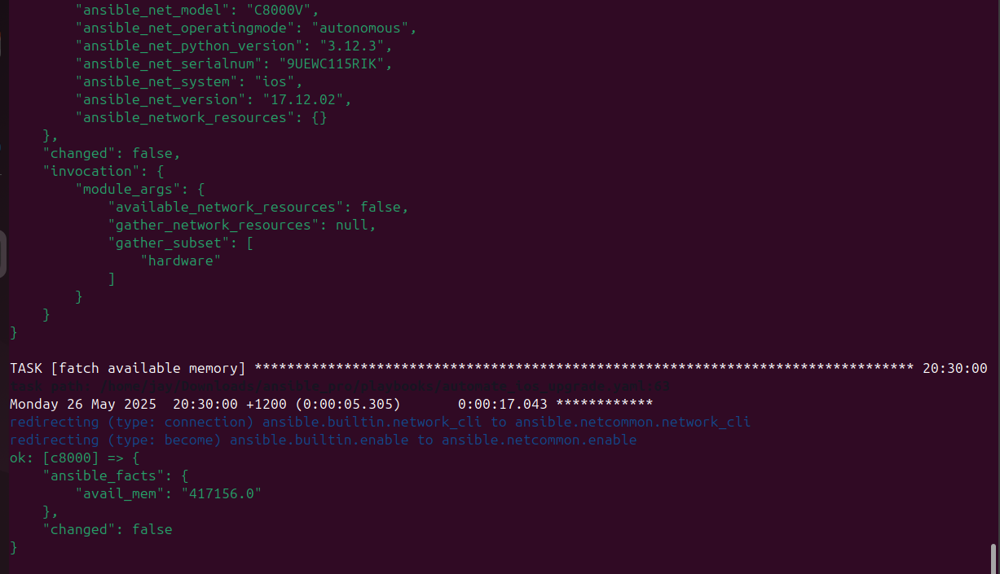

# 🚀 Ansible Pro – Network Automation Toolkit

A modular and production-grade Ansible project designed for automating and managing network devices such as Cisco IOS and Arista EOS. The project includes playbooks for device configuration, OS upgrades, user management, configuration backups, and Slack notifications.

---

## 📦 Features

- Automated Cisco IOS upgrade
- Remote user configuration
- Real-time configuration backup
- Slack notifications for playbook events
- Custom inventory with host/group-specific variables
- Clean and scalable directory structure
- Supports both Cisco IOS and Arista EOS platforms

---

## 🛠 Tech Stack

- **Ansible**
- **YAML**
- **Slack API (Webhooks)**
- **Cisco IOS / Arista EOS**
- **VS Code** (development)

---

## 📁 Folder Structure

```
ansible_pro/
│
├── ansible.cfg                      # Ansible configuration file
├── inventory/
│   ├── inventory.yaml              # Main inventory file
│   ├── group_vars/                 # Group-specific variables
│   └── host_vars/                  # Host-specific variables
│
├── playbooks/
│   ├── automate_ios_upgrade.yaml
│   ├── automate_local_user.yaml
│   ├── automate_use_through_ios.yaml
│   ├── backup_playbook.yaml
│   ├── slack_notification.yaml
│   └── config_backups/            # Output of backed-up configurations
│
└── .vscode/settings.json           # Workspace-specific settings
```

---

## 🚀 Getting Started

### ✅ Prerequisites

- Python 3.8+
- Ansible 2.12+
- Access to Cisco IOS / Arista EOS test environment
- Slack Webhook URL (for notifications)

### ⚙️ Installation

1. Clone the repository:
   ```bash
   git clone https://github.com/yourusername/ansible_pro.git
   cd ansible_pro
   ```

2. Install Ansible:
   ```bash
   pip install ansible
   ```

3. Set up your `inventory/inventory.yaml` and update `group_vars` / `host_vars` as needed.

---

## 🧪 Usage

### Backup Configurations

```bash
ansible-playbook playbooks/backup_playbook.yaml -i inventory/inventory.yaml
```

### Upgrade Cisco IOS

```bash
ansible-playbook playbooks/automate_ios_upgrade.yaml -i inventory/inventory.yaml
```

### Slack Notifications

Ensure your Slack webhook is set in the related playbook before running:

```bash
ansible-playbook playbooks/slack_notification.yaml -i inventory/inventory.yaml
```

---

## ⚙️ Configuration Notes

- **Group Variables** (`group_vars/`): define OS-specific or group-wide settings.
- **Host Variables** (`host_vars/`): define device-specific configurations such as IP, version, platform.
- **Ansible Configuration**: tune default behavior via `ansible.cfg`.

---

## 🤝 Contributing

Feel free to fork this repository, make changes, and open a pull request. Contributions are welcome!

---

## 📸 Screenshots

### ✅ Memory Check and Slack Notification Output



### ✅ Ansible Facts and Resource Gathering


